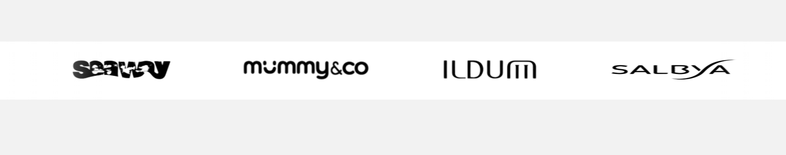
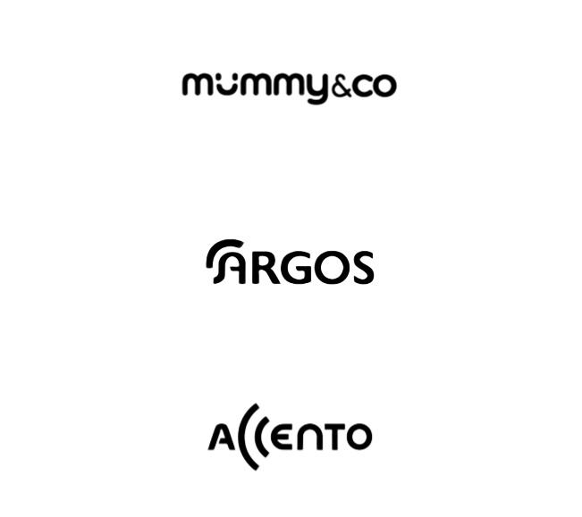

# Slider_Carousel


<p align="center" style="color: white;">
    
</p>


<p>
    <a href="https://www.linkedin.com/in/juan-estaban-ar%C3%A9valo-056bab240/" target="_blank" rel="Linkedin">
      
    </a> 
    <a href="https://www.instagram.com/jeacsi.official_022?igsh=MWJ6MHRwcnhoZXVxbQ==" target="_blank" rel="Instagram">
      
    </a>
</p>
<p>He desarrollado un slider carousel utilizando HTML, CSS y JavaScript que se destaca por su animación suave y su capacidad de avanzar automáticamente en un bucle infinito. Para lograr este efecto continuo y sin interrupciones, he implementado una técnica de clonación del contenedor de imágenes, permitiendo que el carrusel se duplique y ofrezca una experiencia visual ininterrumpida.</p>

```bash
    git clone https://github.com/Juanes200122/Slider_Carousel.git
    cd Slider_Carousel
```
<div align="right">
    


</div>

## <b> Funcionalidad clonacion de contenedor</b>
<div>
    
</div>

```JS
    var copy = document.querySelector(".logos-slide").cloneNode(true);
    document.querySelector(".logos").appendChild(copy);
```


## <b> Skills</b>
  - 💻 &nbsp;
    
  - 🌐 &nbsp;
    
    
    


<div style="background-color:white; padding:10px; border:1px solid #ccc;">

# Título del Contenedor

Este es un ejemplo de contenido dentro de un contenedor con fondo blanco. 

- Elemento de lista 1
- Elemento de lista 2
- Elemento de lista 3

</div>

